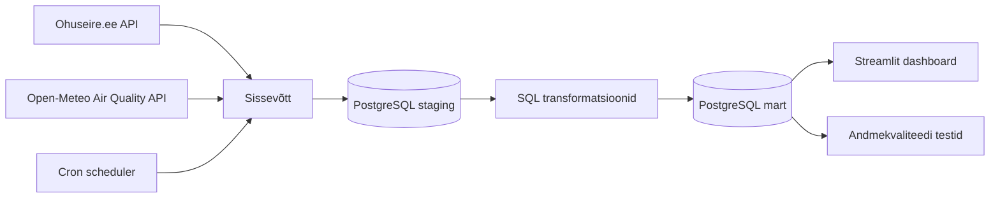

# Õhukvaliteedi mudelprognoosi ja seirejaama mõõtmiste võrdlus

## Äriküsimus

Kui hästi kattub Open-Meteo CAMS mudelipõhine õhukvaliteedi prognoos Eesti seirejaama tegelike mõõtmistega?

Projekt võrdleb Ohuseire.ee mõõteandmeid ja Open-Meteo Air Quality API kaudu saadud CAMS prognoose. Demo keskendub Õismäe mõõtejaamale ja viiele peamisele õhukvaliteedi näitajale: SO₂, NO₂, O₃, PM<sub>10</sub> ja PM<sub>2.5</sub>.

**Mõõdikud:**

1. MAE ehk keskmine absoluutne viga mõõdetud ja prognoositud väärtuste vahel.
2. Korrelatsioon mõõdetud ja prognoositud väärtuste vahel.
3. Keskmine nihe ehk prognoositud väärtus - mõõdetud väärtus, mis näitab, kas CAMS kipub väärtusi üle- või alahindama.

## Arhitektuur



## Andmestik

| Allikas | Tüüp | Ajas muutuv? | Roll |
|---------|------|--------------|------|
| Open-Meteo Air Quality API | API | Jah, iga tund | CAMS mudelprognoosid |
| Ohuseire.ee mõõteandmed | API | Jah, iga tund | Tegelikud mõõtmised Eesti seirejaamast |
| Ohuseire.ee jaamade metaandmed | API | Harva muutuv | Seirejaamade nimed, koodid ja koordinaadid |
| Ohuseire.ee näitajate loend | API | Harva muutuv | Saasteainete nimed, valemid ja ühikud |

## Stack

| Komponent | Tööriist |
|-----------|---------|
| Sissevõtt | Python |
| Transformatsioon | SQL |
| Andmehoidla | PostgreSQL |
| Näidikulaud | Streamlit |
| Orkestreerimine | cron |

## Käivitamine

```bash
# 1. Klooni repo ja liigu kausta
git clone <repo-url> 
cd projektitoo_ohukvaliteedi_vordlus

# 2. Kopeeri keskkonnamuutujad
cp .env.example .env
# Vajadusel muuda .env väärtuseid. Vaikimisi kasutatakse Õismäe mõõtejaama ja viimase 7 päeva andmeid.

# 3. Käivita teenused ja oota 30 sekundit enne näidikulaua avamist
docker compose up -d --build

# See käivitab kolm teenust:
# - PostgreSQL andmebaas
# - pipeline konteiner
# - Streamlit dashboard

# 4. Näidikulaud:
http://localhost:8501

```

## Saladused ja konfiguratsioon 

Kõik saladused (paroolid, API võtmed, andmebaasi URL-id) on `.env` failis. 

Vajalikud muutujad:

| Muutuja | Tähendus | Näide |
|---------|----------|-------|
| `POSTGRES_PASSWORD` | PostgreSQL parool | (saladus) |
| `[teised]` | ... | ... |

## Andmevoog lühidalt

1. **Sissevõtt** — scripts.seed_dimensions pärib Ohuseire.ee API-st jaamade ja indikaatorite metaandmed ning salvestab need mart.dim_station ja mart.dim_indicator tabelitesse.
scripts.fetch_ohuseire_monitoring pärib Ohuseire.ee mõõteandmed valitud jaamade ja indikaatorite kohta.
scripts.fetch_openmeteo_airquality pärib Open-Meteo Air Quality API kaudu CAMS prognoosiandmed samadele saasteainetele.
2. **Laadimine** — Toorandmed salvestatakse PostgreSQL staging skeemi.
3. **Transformatsioon** — scripts/transform.sql teisendab andmed analüüsiks sobivasse kujusse. Mõõdetud ja prognoositud väärtused viiakse ühisesse faktitabelisse mart.fact_air_quality_observation.
4. **Testimine** — scripts/quality_tests.sql kontrollib andmete korrektsust ning salvestab tulemused tabelisse quality.test_results. Projektis on 4 andmekvaliteedi testi.
5. **Näidikulaud** — Mõõdetud ja prognoositud väärtuseid võrreldakse sama jaama, saasteaine ja tunni alusel. Dashboard kasutab võrdluseks tabelit või vaadet mart.fact_air_quality_comparison. Streamlit dashboard kuvab KPI-d, mõõdetud ja prognoositud väärtuste ajagraafiku, prognoosivea graafiku, suurimad prognoosivead ja andmekvaliteedi testide tulemused.

## Andmekvaliteedi testid 

Projekt kontrollib järgmist:

| Test | Selgitus |
|---------|----------|
| fact_no_negative_values | Kontrollib, et mõõdetud ja prognoositud väärtused ei oleks negatiivsed |
| fact_pk_unique | Kontrollib, et faktitabeli loogiline primaarvõti oleks unikaalne |
| fact_indicators_have_dim | Kontrollib, et iga faktirea indicator_id eksisteeriks dim_indicator tabelis |
| fact_measurements_recent | Kontrollib, et viimane mõõtmine ei oleks vanem kui 6 tundi |

Testide tulemused salvestatakse: quality.test_results ning kuvatakse ka Streamlit dashboardis.

## Projekti struktuur 

```
.
.
├── README.md
├── compose.yml
├── Dockerfile
├── requirements.txt
├── .env.example
├── dashboard/
│   └── app.py
│   └── _init_.py
├── init/
│   └── 01_create_schemas.sql
├── scripts/
│   ├── fetch_ohuseire_metadata.py
│   ├── fetch_ohuseire_monitoring.py
│   ├── fetch_openmeteo_airquality.py
│   ├── seed_dimensions.py
│   ├── run_pipeline.sh
│   ├── transform.sql
│   ├── quality_tests.sql
│   └── pipeline/
│       ├── __init__.py
│       └── db.py
├── docs/
│   ├── arhitektuur.md
│   └── progress.md
├── notebooks/
│   └── 01_ohuseire.ipynb
└── data/
    ├── staging/
    └── processed/
```

## Kokkuvõte, puudused ja võimalikud edasiarendused 

**Kokkuvõte:**
Valmis on töötav andmevoog, mis:

- pärib andmeid kahest ajas muutuvast API-st;
- laeb andmed PostgreSQL andmebaasi;
- teisendab toorandmed mart kihiks;
- arvutab mõõdetud ja prognoositud väärtuste võrdluse;
- käivitab andmekvaliteedi testid;
- kuvab tulemused Streamlit dashboardis;
- töötab Docker Compose abil korratavalt.

**Puudused:**
- Lõplik demo keskendub ühele mõõtejaamale, Õismäele.
- Andmete ajalooline ulatus on vaikimisi piiratud viimase 7 päevaga.
- Kõiki Eesti mõõtejaamu ei ole dashboardis kasutusele võetud.
-Mõned lühiajalised mõõtepiigid võivad prognoosimudelist erineda, mistõttu üksikute tundide vead võivad olla suuremad.

**Mis edasi:**
- Lisada rohkem Eesti õhukvaliteedi seirejaamu.
- Pikendada ajaloolist ajavahemikku.
- Lisada Eesti kaardivaade jaamade võrdlemiseks.
- Lisada rohkem mudelikvaliteedi mõõdikuid.
- Lisada automaatsed raportid või kokkuvõtted pipeline’i viimase jooksu kohta.

## Meeskond - rollid

| Nimi | Roll |
|------|------|
| Anna-Liisa Hannus | Transformatsioonid ja andmebaasi mudel |
| Heigo Reinek | Andmekvaliteedi testid ja tehniline viimistlus |
| Kristen Maisey| Dashboard ja dokumentatsioon |
| Liivika Koobakene | Andmete sissevõtt ja pipeline |
