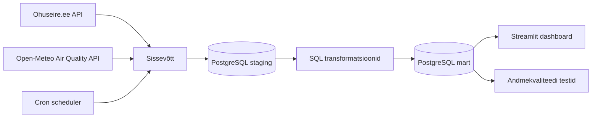

# Õhukvaliteedi mudelprognoosi ja seirejaama mõõtmiste võrdlus

## Äriküsimus

Kui hästi kattub Open-Meteo CAMS mudelipõhine õhukvaliteedi prognoos Eesti seirejaama tegelike mõõtmistega?

Projekt võrdleb Ohuseire.ee mõõteandmeid ja Open-Meteo Air Quality API kaudu saadud CAMS prognoose. Demo keskendub Õismäe mõõtejaamale ja viiele peamisele õhukvaliteedi näitajale: SO₂, NO₂, O₃, PM<sub>10</sub> ja PM<sub>2.5</sub>.

**Mõõdikud:**

1. **MAE** ehk keskmine absoluutne viga mõõdetud ja prognoositud väärtuste vahel.
2. **Korrelatsioon** mõõdetud ja prognoositud väärtuste vahel.
3. **Keskmine nihe** (bias) ehk prognoositud väärtus − mõõdetud väärtus, mis näitab, kas CAMS kipub väärtusi üle- või alahindama.
4. **Õhukvaliteedi indeks** (EEA European Air Quality Index, 6 taset: 1 = Hea … 6 = Eriti halb) iga tunni kohta, eraldi mõõdetud ja prognoositud andmete põhjal.
5. **Indeksi kokkulangevus** — kui suurel osal tundidest klassifitseerivad CAMS ja seirejaam õhukvaliteedi samasse tasemesse.

## Arhitektuur



Mart kihis on **dimensioonitabelid** (`dim_station`, `dim_indicator`) ja **faktitabel** `fact_air_quality_observation`, mille granulaarsus on üks rida `(station_id, indicator_id, ts_hour, observation_type)` kohta. Mõõdetud ja prognoositud väärtused on samas tabelis, neid eristab `observation_type` veerg.

Võrdlus, mõõdikud ja indeks on **vaadetena** mart kihis (kõik arvutused on andmekihis, mitte dashboardis):

| Vaade | Sisu |
|---|---|
| `fact_air_quality_comparison` | Mõõdetud ja prognoositud väärtus samal real `(station, indicator, tund)` kohta + vahe ja absoluutviga |
| `fact_pollutant_index` | Iga vaatluse EEA indeksi tase 1–6 (per saasteaine) |
| `fact_air_quality_index` | Üldindeks per `(station, tund, observation_type)` = halvim üksiku saasteaine indeks |
| `fact_air_quality_metrics` | MAE, bias, korrelatsioon per `(station, indicator)` |
| `fact_hourly_error` | Keskmine prognoosiviga ööpäeva tunni kaupa (Eesti aeg) |
| `fact_index_match` | Mõõdetud vs prognoositud indeksi tase ja kas need klapivad |

## Andmestik

| Allikas | Tüüp | Ajas muutuv? | Roll |
|---------|------|--------------|------|
| Open-Meteo Air Quality API | API | Jah, iga tund | CAMS mudelprognoosid |
| Ohuseire.ee mõõteandmed | API | Jah, iga tund | Tegelikud mõõtmised Eesti seirejaamast |
| Ohuseire.ee jaamade metaandmed | API | Harva muutuv | Seirejaamade nimed, koodid ja koordinaadid |
| Ohuseire.ee näitajate loend | API | Harva muutuv | Saasteainete nimed, valemid ja ühikud |

## Stack

| Komponent | Tööriist |
|-----------|---------|
| Sissevõtt | Python |
| Transformatsioon | SQL |
| Andmehoidla | PostgreSQL |
| Näidikulaud | Streamlit + Plotly |
| Orkestreerimine | cron (pipeline konteineris) |
| Käivituskeskkond | Docker Compose |

## Käivitamine

```bash
# 1. Klooni repo ja liigu kausta
git clone <repo-url>
cd projektitoo_ohukvaliteedi_vordlus

# 2. Kopeeri keskkonnamuutujad
cp .env.example .env
# Vajadusel muuda .env väärtuseid. Vaikimisi kasutatakse Õismäe mõõtejaama (S05)
# ja viimase 7 päeva andmeid.

# 3. Käivita teenused ja oota ~30 sekundit enne näidikulaua avamist
docker compose up -d --build

# See käivitab kolm teenust:
# - db        — PostgreSQL andmebaas
# - pipeline  — ETL (sissevõtt + transformatsioon + andmekvaliteedi testid), cron iga tund
# - dashboard — Streamlit näidikulaud

# 4. Kontrolli logisid (eduka jooksu lõpus on rida "==> Pipeline lõpetatud")
docker compose logs pipeline --tail 30

# 5. Ava näidikulaud:
#    http://localhost:8501
```

## Saladused ja konfiguratsioon

Kõik saladused ja seaded on `.env` failis (vaata `.env.example`-st malli). Repos pärisparoole ei hoita.

| Muutuja | Tähendus | Vaikeväärtus |
|---------|----------|--------------|
| `POSTGRES_USER` | PostgreSQL kasutaja | `praktikum` |
| `POSTGRES_PASSWORD` | PostgreSQL parool | (saladus, kohustuslik muuta) |
| `POSTGRES_DB` | Andmebaasi nimi | `ohukvaliteet` |
| `DB_PORT_HOST` | Hostmasinas DB port | `55432` |
| `DASHBOARD_PORT_HOST` | Hostmasinas Streamliti port | `8501` |
| `LOAD_DAYS` | Mitme päeva tagant andmeid laadida (Open-Meteo lubab kuni 92) | `7` |
| `STATIONS` | Komaeraldatud jaamade airviro koodid (S05=Õismäe) | `S05` |
| `INDICATOR_IDS` | Komaeraldatud ohuseire indikaatorite ID-d (1=SO₂, 3=NO₂, 6=O₃, 21=PM10, 23=PM2.5) | `1,3,6,21,23` |
| `PIPELINE_CRON` | Cron pipeline'i jooksutamiseks, käivitab pipeline igal täistunnil | `0 * * * *` |
| `RUN_ON_STARTUP` | Kas käivitada pipeline kohe konteinerit startides | `true` |

## Andmevoog lühidalt

1. **Sissevõtt**
   - `scripts/seed_dimensions.py` pärib Ohuseire.ee API-st jaamade ja indikaatorite metaandmed ning salvestab need `mart.dim_station` ja `mart.dim_indicator` tabelitesse.
   - `scripts/fetch_ohuseire_monitoring.py` pärib Ohuseire.ee mõõteandmed valitud jaamade ja indikaatorite kohta.
   - `scripts/fetch_openmeteo_airquality.py` pärib Open-Meteo Air Quality API kaudu CAMS prognoosiandmed samadele saasteainetele jaama koordinaatidelt.
2. **Laadimine** — Toorandmed kirjutatakse PostgreSQL `staging` skeemi (`staging.ohuseire_monitoring_raw`, `staging.openmeteo_airquality_raw`). Iga jooks logitakse `staging.pipeline_runs` tabelisse koos `run_id`-ga (auditeeritav, idempotentne).
3. **Transformatsioon** — `scripts/transform.sql` viib mõõdetud ja prognoositud väärtused ühisesse faktitabelisse `mart.fact_air_quality_observation` (ajavööndid normaliseeritud UTC-sse, müraga negatiivsed väärtused vahemikus `[-0.5, 0)` teisendatakse nulliks). Lisaks loob/uuendab kõik analüüsivaated (võrdlus, mõõdikud, indeks, tunnipõhine viga, indeksi kokkulangevus) — kogu äriloogika on **mart kihis**, dashboard teeb ainult `SELECT`-e.
4. **Testimine** — `scripts/quality_tests.sql` kontrollib andmete korrektsust ning salvestab tulemused tabelisse `quality.test_results`. Projektis on 4 andmekvaliteedi testi (vt allpool).
5. **Näidikulaud** — Streamlit dashboard kuvab valitud jaama ja saasteaine kohta:
   - KPI-d: MAE, korrelatsioon, keskmine nihe + kvalitatiivsed tõlgenduskastid;
   - **Mõõdetud vs CAMS prognoos ajagraafik** koos EEA 6-tasemelise indeksi värvikoodiga (joone värv vastab vastaval hetkel kehtivale indeksi tasemele, piirid on lõikepunktidesse interpoleeritud);
   - **Prognoosivea graafik** ajas;
   - **Tunnipõhine keskmine viga** (kas CAMS eksib süstemaatiliselt teatud kellaaegadel);
   - **Üldindeksi võrdlus**: mõõdetud ja prognoositud üldindeks ajas + KPI-d "Viimane mõõdetud indeks", "Perioodi keskmine", "Indeks klapib prognoosiga (%)";
   - Andmekvaliteedi testide viimased tulemused.

## Andmekvaliteedi testid

| Test | Selgitus |
|------|----------|
| `fact_no_negative_values` | Kontrollib, et mõõdetud ja prognoositud väärtused ei oleks negatiivsed (mürataseme puhastuse järel) |
| `fact_pk_unique` | Kontrollib, et faktitabeli loogiline primaarvõti `(station_id, indicator_id, ts_hour, observation_type)` oleks unikaalne |
| `fact_indicators_have_dim` | Kontrollib, et iga faktirea `indicator_id` eksisteeriks `dim_indicator` tabelis (viidaintegritseet) |
| `fact_measurements_recent` | Kontrollib, et viimane mõõtmine ei oleks vanem kui 6 tundi (cron töötab) |

Testide tulemused salvestatakse tabelisse `quality.test_results` ja kuvatakse Streamlit dashboardis.

## Õhukvaliteedi indeks

Indeks põhineb [EEA European Air Quality Index](https://airindex.eea.europa.eu/AQI/index.html#) skaalal (6 taset).

| Tase | Nimi | Värv | PM2.5 | PM10 | O₃ | NO₂ | SO₂ |
|---|---|---|---|---|---|---|---|
| 1 | Hea | helesinine | 0–5 | 0–15 | 0–60 | 0–10 | 0–20 |
| 2 | Rahuldav | rohekas | 5–15 | 15–45 | 60–100 | 10–25 | 20–40 |
| 3 | Keskmine | kollane | 15–50 | 45–120 | 100–120 | 25–60 | 40–125 |
| 4 | Halb | punane | 50–90 | 120–195 | 120–160 | 60–100 | 125–190 |
| 5 | Väga halb | tumepunane | 90–140 | 195–270 | 160–180 | 100–150 | 190–275 |
| 6 | Eriti halb | lilla | >140 | >270 | >180 | >150 | >275 |

Ühikud kõik µg/m³. Üldindeks tunni kohta = **halvim** üksiku saasteaine indeks samal tunnil samas jaamas.

## Projekti struktuur

```
.
├── README.md
├── compose.yml
├── Dockerfile
├── requirements.txt
├── .env.example
├── dashboard/
│   ├── __init__.py
│   └── app.py
├── init/
│   └── 01_create_schemas.sql
├── scripts/
│   ├── fetch_ohuseire_metadata.py
│   ├── fetch_ohuseire_monitoring.py
│   ├── fetch_openmeteo_airquality.py
│   ├── seed_dimensions.py
│   ├── run_pipeline.sh
│   ├── transform.sql
│   ├── quality_tests.sql
│   └── pipeline/
│       ├── __init__.py
│       └── db.py
├── docs/
│   ├── arhitektuur.md
│   └── progress.md
├── notebooks/
│   └── 01_ohuseire.ipynb
└── data/
    ├── staging/
    └── processed/
```

## Kokkuvõte, puudused ja võimalikud edasiarendused

**Kokkuvõte:**

Valmis on töötav andmevoog, mis:

- pärib andmeid kahest ajas muutuvast API-st (Ohuseire.ee ja Open-Meteo CAMS);
- laeb toorandmed PostgreSQL staging kihti koos run-auditeerimisega;
- teisendab need mart kihiks (1 fakttabel + 6 analüüsivaadet);
- arvutab MAE, biasi, korrelatsiooni ja õhukvaliteedi indeksi otse andmebaasi tasemel;
- käivitab iga jooksu järel andmekvaliteedi testid;
- kuvab tulemused Streamlit dashboardis;
- töötab Docker Compose abil korratavalt ja cron'iga uueneb iga tund.

**Puudused:**

- Lõplik demo keskendub ühele mõõtejaamale, Õismäele. Kuigi pipeline toetab mitut jaama (`STATIONS` muutuja), pole rohkem jaamu testimisel valideeritud.
- Andmete ajalooline ulatus on vaikimisi 7 päeva (Open-Meteo lubaks kuni 92).
- Õismäe õhk on demoperioodil olnud puhas, mistõttu indeks püsib enamasti tasemel 1–2. Kõrgemad tasemed (3–6) ei pruugi praeguses andmestikus ilmuda.
- Cron-scheduler jookseb pipeline-konteineris, mitte eraldi orkestreerimisvahendis (Airflow/Prefect); reaalseks tootmiskeskkonnaks vajaks tugevamat töövoo halduse kihti.

**Mis edasi:**

- Lisada rohkem Eesti õhukvaliteedi seirejaamu ja Eesti kaardivaade.
- Pikendada ajaloolist ajavahemikku ja teha trendianalüüsi (kuude/aastate kaupa).
- Lisada rohkem mudelikvaliteedi mõõdikuid (nt RMSE, hit rate kõrgematel tasemetel).
- Lisada automaatsed raportid või kokkuvõtted iga pipeline jooksu kohta.
- Tugevdada orkestreerimist (Airflow).

## Meeskond — rollid

| Nimi | Roll |
|------|------|
| Liivika Koobakene | Andmete sissevõtt, pipeline, andmebaasi mudel, transformatsioonid, kvaliteedimõõdikud |
| Anna-Liisa Hannus | Andmete sissevõtt, pipeline, dashboard, dokumentatsioon |
| Kristen Maisey | Dashboard ja dokumentatsioon |
