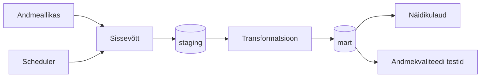

# Arhitektuur

> **Juhend:** See fail on projektitöö esimese nädala väljund. Asenda kõik nurksulgudes plankid oma projekti tegeliku sisuga. Kustuta see juhendrida.

## Äriküsimus

Kui hästi kattub mudelipõhine õhukvaliteedi hinnang Eesti seirejaamade tegelike mõõtmistega? 
Näidikulaud võiks näidata mõõdetud väärtust, mudelväärtust, nende vahet ja keskmist absoluutset viga.

 

## Mõõdikud

1. Mudelipõhise hinnangu erinevus tegelikest mõõtmistest - 
2. [Teine mõõdik — kirjelda, mida arvutate ja kuidas]
3. [Kolmas mõõdik — vabatahtlik]

## Andmeallikad

| Allikas | Tüüp | Ajas muutuv? | Roll |
|---------|------|--------------|------|
| Open-Meteo Air Quality API | API | Jah, [iga X tundi / päeva] | Mudelipõhiste õhukvaliteedi andmete saamiseks |
| Ohuseire.ee | JSON | ... | Eesti seirejaamade mõõteandmete saamiseks |
| [Nimi] | [seed / dim-tabel] | Ei, staatiline | [Milleks kasutatakse?] |

*- Open-Meteo Air Quality API annab CAMS mudelipõhiseid õhukvaliteedi andmeid. past_days võimaldab küsida kuni 92 päeva tagasi ja start_date / end_date kaudu saab küsida ajaloolist CAMS reanalüüsi. Ohuseire.ee annab Eesti seirejaamade mõõteandmeid JSON-kujul, näiteks jaamad https://www.ohuseire.ee/api/station/et?type=INDICATOR, näitajad https://www.ohuseire.ee/api/indicator/et?type=INDICATOR ja mõõtmised https://www.ohuseire.ee/api/monitoring/et?....*

## Andmevoog

> Täpsusta diagrammi vastavalt oma projektile — lisa rohkem andmeallikaid, mudeleid või teenuseid.

## Andmebaasi kihid

| Kiht | Roll |
|------|------|
| `staging` | Hoiab allika andmeid töötlemata kujul. |
| `mart` | Hoiab transformeeritud ja ärilogikat sisaldavaid tabeleid. |

## Tööjaotus

| Roll | Vastutus | Täitja |
|------|----------|--------|
| Andmeallika omanik | Kirjutab sissevõtu loogika, hoiab API-t töös | [Nimi] |
| Transformatsioonide omanik | Kirjutab mart kihi mudelid ja mõõdikute arvutuse | [Nimi] |
| Kvaliteedi omanik | Kirjutab testid ja vaatab läbi ebaõnnestunud kontrollid | [Nimi] |
| Näidikulaua omanik | Ehitab näidikulaua ja seob selle äriküsimusega | [Nimi] |

## Riskid

| Risk | Mõju | Maandus |
|------|------|---------|
| [Risk 1 — näiteks: API ei vasta] | [Mis juhtub?] | [Kuidas maandad?] |
| [Risk 2] | [Mis juhtub?] | [Kuidas maandad?] |
| [Risk 3] | [Mis juhtub?] | [Kuidas maandad?] |

## Privaatsus ja turve

[Kirjelda, millised isiku- või tundlikud andmed teie projektis esinevad (kui üldse) ja kuidas neid kaitsete. Isikuandmed peavad olema anonümiseeritud. Andmebaasi paroolid peavad tulema `.env` failist.]
