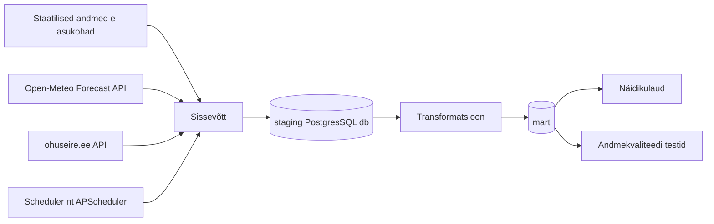

# Arhitektuur

## Äriküsimus

Kui hästi kattub mudelipõhine õhukvaliteedi hinnang Eesti seirejaamade tegelike mõõtmistega? 
Projektis võetakse Eesti Keskkonnauuringute Keskuse (EKUK) õhuseire veebilehe ohuseire.ee API-st valitud mõõtejaamadest mõõdetud õhukvaliteedi näitajad, mille põhjal leitakse igale tunnile õhukvaliteedi indeks (link: [Keskkonnaportaal EESTI ÕHUKVALITEEDI ÜLEVAADE](https://keskkonnaportaal.ee/sites/default/files/Teemad/Välisõhk/Õhuaruanne%202022.pdf))

Allikas: [Keskkonnaportaal EESTI ÕHUKVALITEEDI ÜLEVAADE](https://keskkonnaportaal.ee/sites/default/files/Teemad/Välisõhk/Õhuaruanne%202022.pdf)

Peamised viis õhukvaliteedi mõõdikut: 
- osakesed (PM2.5 ja PM10),
- troposfääri osoon (O3)
- lämmastikdioksiid (NO2)
- vääveldioksiid (SO2)

Samade parameetrite kohta võetakse mudelarvutatud tulemused Open-Meteo API-st, mis koondab CAMS mudelarvutuse tulemusi. Parameetrid talletatakse samade tundide kohta. 
Andmeid värskendatakse scheduleriga igal täistunnil(võib muutuda olenevalt sellest kuidas andmed päriselt uuenevad). 

Näidikulaual kuvatakse trendidena iga parameetri mõõdetud ja arvutatud väärtused ja õhukvaliteedi indeks valitud ajavahemikus koos nende vahe ja keskmise absoluutveaga (vb ka korrelatsioonikordaja). 

 
## Mõõdikud

1. **Mudelipõhise hinnangu erinevus tegelikest mõõtmistest**  
   Näidikulaual kuvame iga ajahetke ja seirejaama kohta vahe `prognoositud väärtus - mõõdetud väärtus`.

2. **Keskmine absoluutne viga (MAE)**  
   MAE näitab, kui suur on mudelprognoosi tüüpiline viga  mõõdetud õhukvaliteedi näitajaga võrreldes.

$$
MAE = \frac{1}{n} \sum_{i=1}^{n} \left| \hat{y}_i - y_i \right|
$$

   Siin on $\hat{y}_i$ prognoositud väärtus, $y_i$ mõõdetud väärtus ja $n$ vaatluste arv. Mida väiksem on $MAE$, seda lähemal on mudeli hinnangud tegelikele mõõtmistele.

3. **Korrelatsioonikordaja (Pearson $r$)**  
   Pearsoni korrelatsioonikordaja näitab, kui hästi mudel tabab mõõdetud väärtuste ajas muutumise trendi.

$$
r = \frac{\sum_{i=1}^{n} (\hat{y}_i - \bar{\hat{y}})(y_i - \bar{y})}{\sqrt{\sum_{i=1}^{n} (\hat{y}_i - \bar{\hat{y}})^2}\,\sqrt{\sum_{i=1}^{n} (y_i - \bar{y})^2}}
$$

  $\bar{\hat{y}}$ on prognoositud väärtuste keskmine ja $\bar{y}$ mõõdetud väärtuste keskmine. Mida lähemal on $r$ väärtusele 1, seda paremini tabab mudel mõõdetud väärtuste muutuste trendi ajas.

Täpsustuseks:
### Mõõdetud andmed (Eesti seirejaamad, ohuseire.ee)

- Eestis on **17 õhukvaliteedi seirejaama**
- Valikusse võetakse jaamad, millel on kõik viis parameetrit olemas
- Mõõtmiste intervall: **tunnipõhine, reaalajas**.
- Allikas: `ohuseire.ee` API

### Prognoositud andmed (Open-Meteo Air Quality API, CAMS)

- Allikas: **CAMS European air quality forecast** Open-Meteo API kaudu.
- Mõõtepunktideks valitakse iga Eesti seirejaama koordinaatidele lähim 11x11 km ruudustikukastike.
- Intervall: **tunnipõhised väärtused**.
- Ajalooline vahemik: `start_date` / `end_date` kaudu, viimaseid x päeva ka `past_days` parameetriga (maksimaalselt 92 päeva võimalik). 
- Päring koordinaatide järgi (jaama lat/lon);  valime lähima ruudustiku punkti.

### Mida millega võrrelda

Iga seirejaama mõõdetud väärtust võrreldakse **sama tunni** Open-Meteo prognoosiga, mis on päritud jaama koordinaatidelt. Võrdlus tehakse ainult **ühiste näitajate** lõikes:
Võrdluse aluseks on **(jaam, näitaja, tund)** ühik: iga selline rida saab kaks väärtust (mõõdetud, prognoositud), mille põhjal arvutame mõõdikud (MAE, Bias, Pearson r).

## Andmeallikad

| Allikas | Tüüp | Ajas muutuv? | Roll |
|---------|------|--------------|------|
| Open-Meteo Air Quality API | API | Jah, iga tund | Mudelprognooside põhiandmevoog |
| Ohuseire.ee mõõteandmed | API | Jah, iga tund | Tegelikud mõõtmised |
| Ohuseire.ee jaamade metaandmed | API | Harva muutuv | Seirejaamade kirjeldused |
| Ohuseire.ee näitajate loend | API | Harva muutuv | Saasteainete ja mõõdikute kirjeldused |

<!-- *- Open-Meteo Air Quality API annab CAMS mudelipõhiseid õhukvaliteedi andmeid. past_days võimaldab küsida kuni 92 päeva tagasi ja start_date / end_date kaudu saab küsida ajaloolist CAMS reanalüüsi. Ohuseire.ee annab Eesti seirejaamade mõõteandmeid JSON-kujul, näiteks jaamad https://www.ohuseire.ee/api/station/et?type=INDICATOR, näitajad https://www.ohuseire.ee/api/indicator/et?type=INDICATOR ja mõõtmised https://www.ohuseire.ee/api/monitoring/et?....* -->

## Andmevoog 

mart kihis kasutatakse dimensioon- ja faktitabelite loogikat. Dimensioonitabelid mart.dim_station, mart.dim_indicator ja mart.dim_time hoiavad jaamade, näitajate ja aja kirjeldavat infot, faktitabelid aga ajas muutuvaid väärtusi.

Peamine faktitabel on mart.fact_air_quality_observation, mille granulaarsus on üks rida ühe (station_id, indicator_id, ts_hour, observation_type) kohta. Selles tabelis hoitakse nii mõõdetud kui prognoositud tunniväärtusi; veerg observation_type eristab, kas tegemist on mõõdetud (measured) või prognoositud (forecast) väärtusega.

Võrdluseks luuakse eraldi tuletatud faktitabel või vaade mart.fact_air_quality_comparison, mille granulaarsus on üks rida ühe (station_id, indicator_id, ts_hour) kohta. Selles tabelis on samal real measured_value ja forecast_value, mille põhjal arvutatakse vahe, absoluutviga ja soovi korral muud võrdlusmõõdikud näidikulaua jaoks.

## Andmebaasi kihid

| Kiht | Roll |
|------|------|
| `staging` | Hoiab allika andmeid töötlemata kujul. |
| `mart` | Hoiab transformeeritud ja ärilogikat sisaldavaid tabeleid. |

## Tööjaotus

| Roll | Vastutus | Täitja |
|------|----------|--------|
| Andmeallika omanik | Kirjutab sissevõtu loogika, hoiab API-t töös | Liivika/Anna-Liisa |
| Transformatsioonide omanik | Kirjutab mart kihi mudelid ja mõõdikute arvutuse | Liivika/Anna-Liisa |
| Kvaliteedi omanik | Kirjutab testid ja vaatab läbi ebaõnnestunud kontrollid | Kristen/Heigo |
| Näidikulaua omanik | Ehitab näidikulaua ja seob selle äriküsimusega | Kristen/Heigo |

## Riskid

| Risk | Mõju | Maandus |
|---|---|---|
| Õhuseire või Open-Meteo API ei vasta / aegub | Mõõte- või prognoosandmeid ei saa värskendada, võrdlus katki | Ingest-skript annab selge veateate ja logib `run_id` kaupa, scheduler proovib hiljem uuesti või töö saab käsitsi uuesti käivitada. |
| Õhuseire / Open-Meteo API andmeskeem muutub (väljade nimed, ühikud) | Laadimine katkeb või arvutused muutuvad valeks (valed ühikud, segased parameetrid) | Staging-kihi laadimisel on skeemi ja ühiku kontrollid, muudatuse korral katkestatakse töövoog, mitte ei kirjutata mart’i vales formaadis andmeid. |
| Mõõdetud ja prognoositud väärtused ei joondu samale tunnile (puuduvad tunnid, nihked ajavööndis) | Võrdlustabelis tekivad valed või ebapiisavad võrdluspaarid, näidikud on eksitavad | Mart-kihis on join `(station_id, indicator_id, ts_hour)` alusel; laadimise järel jooksevad kvaliteeditestid, mis kontrollivad ühiste tundide osakaalu ja raporteerivad aukude osakaalu. |
| Õhukvaliteedi näitajate valik või indeksivalem muutub projekti keskel | Uued raportid ei ole vanadega võrreldavad, MAE ja indeksid muutuvad tõlgendamatuks | Indikaatorite ja indeksivalemi versioon hoitakse `dim_indicator` / eraldi konfiguratsioonis; mart’is on versiooniveerg, mille alusel saab vajadusel filtreerida ainult viimase versiooni andmeid. |
| Scheduler ei tööta (nt APScheduler ei käivitu või konteiner jookseb kinni) | Andmeid ei värskendata automaatselt, näidikulaud võib näidata vanu väärtusi | Scheduler logib iga käivituse; näidikulaual kuvatakse viimase eduka `run_id` aeg; vajadusel saab pipeline’i käsitsi käivitada. |
| Andmekvaliteedi probleemid allikas (outlier’id, pikem katkestus jaama tasemel) | MAE ja muud mõõdikud võivad olla moonutatud või tugineda väga vähestele vaatlustele | Mart-kihis arvutatakse iga `(jaam, näitaja)` kohta vaatluste arv ja erindite indikaatorid; kvaliteedikontrolli kihis hoitakse testi tulemusi ja näidikulaual saab filtreerida minimaalse vaatluste arvu järgi. |

## Privaatsus ja turve

Projektis ei esine isikuandmeid ega tundlikke andmeid. 

Andmebaasi paroolid tulevad `.env` failist.
