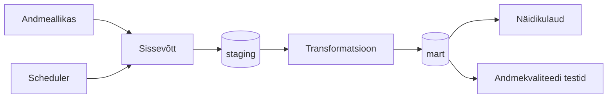

# Arhitektuur

> **Juhend:** See fail on projektitöö esimese nädala väljund. Asenda kõik nurksulgudes plankid oma projekti tegeliku sisuga. Kustuta see juhendrida.

## Äriküsimus

Kui hästi kattub mudelipõhine õhukvaliteedi hinnang Eesti seirejaamade tegelike mõõtmistega? 
Näidikulaud võiks näidata mõõdetud väärtust, mudelväärtust, nende vahet ja keskmist absoluutset viga.

 
## Mõõdikud

1. **Mudelipõhise hinnangu erinevus tegelikest mõõtmistest**  
   Näidikulaual kuvame iga ajahetke ja seirejaama kohta vahe `prognoositud väärtus - mõõdetud väärtus`.

2. **Keskmine absoluutne viga (MAE)**  
   MAE näitab, kui suur on mudelprognoosi tüüpiline viga  mõõdetud õhukvaliteedi näitajaga võrreldes.

$$
MAE = \frac{1}{n} \sum_{i=1}^{n} \left| \hat{y}_i - y_i \right|
$$

   Siin on $\hat{y}_i$ prognoositud väärtus, $y_i$ mõõdetud väärtus ja $n$ vaatluste arv. Mida väiksem on $MAE$, seda lähemal on mudeli hinnangud tegelikele mõõtmistele.

3. **Keskmine viga / nihe (Bias, Mean Error)**  
   Bias näitab, kas mudel kipub väärtusi süsteemselt üle või alahindama.

$$
ME = \frac{1}{n} \sum_{i=1}^{n} \left( \hat{y}_i - y_i \right)
$$

   Positiivne $ME$ tähendab, et mudel pigem ülehindab, ja negatiivne $ME$ tähendab, et mudel pigem alahindab.

4. **Korrelatsioonikordaja (Pearson $r$)**  
   Pearsoni korrelatsioonikordaja näitab, kui hästi mudel tabab mõõdetud väärtuste ajas muutumise trendi.

$$
r = \frac{\sum_{i=1}^{n} (\hat{y}_i - \bar{\hat{y}})(y_i - \bar{y})}{\sqrt{\sum_{i=1}^{n} (\hat{y}_i - \bar{\hat{y}})^2}\,\sqrt{\sum_{i=1}^{n} (y_i - \bar{y})^2}}
$$

  $\bar{\hat{y}}$ on prognoositud väärtuste keskmine ja $\bar{y}$ mõõdetud väärtuste keskmine. Mida lähemal on $r$ väärtusele 1, seda paremini tabab mudel mõõdetud väärtuste muutuste trendi ajas.

Täpsustuseks:
### Mõõdetud andmed (Eesti seirejaamad, ohuseire.ee)

- Eestis on **9 riiklikku õhukvaliteedi seirejaama** (+ ettevõtete seirejaamad).
- Mõõdetavad näitajad sõltuvalt jaamast: **SO₂, NO₂, NOx, CO, O₃, PM10, PM2.5, H₂S, benseen, fenool, formaldehüüd**, mõnes jaamas on ka ilmastikuparameetreid.
- Mõõtmiste intervall: **tunnipõhine, reaalajas**.
- Allikas: `ohuseire.ee` API

### Prognoositud andmed (Open-Meteo Air Quality API, CAMS)

- Allikas: **CAMS European air quality forecast / reanalysis** Open-Meteo API kaudu.
- Saadaval näitajad: **PM10, PM2.5, CO, NO₂, SO₂, O₃**, aerosoolide optiline paksus(?) ja õietolm.
- Intervall: **tunnipõhised väärtused**.
- Ajalooline vahemik: `start_date` / `end_date` kaudu, viimaseid 92 päeva ka `past_days` parameetriga.
- Päring koordinaatide järgi (jaama lat/lon);  valime lähima ruudustiku punkti.

### Mida millega võrrelda

Iga seirejaama mõõdetud väärtust võrreldakse **sama tunni** Open-Meteo prognoosiga, mis on päritud jaama koordinaatidelt. Võrdlus tehakse ainult **ühiste näitajate** lõikes:
Võrdluse aluseks on **(jaam, näitaja, tund)** ühik: iga selline rida saab kaks väärtust (mõõdetud, prognoositud), mille põhjal arvutame mõõdikud (MAE, Bias, Pearson r).

## Andmeallikad

| Allikas | Tüüp | Ajas muutuv? | Roll |
|---------|------|--------------|------|
| Open-Meteo Air Quality API | API | Jah, [iga X tundi / päeva] | Mudelipõhiste õhukvaliteedi andmete saamiseks |
| Ohuseire.ee | JSON | ... | Eesti seirejaamade mõõteandmete saamiseks |
| [Nimi] | [seed / dim-tabel] | Ei, staatiline | [Milleks kasutatakse?] |

*- Open-Meteo Air Quality API annab CAMS mudelipõhiseid õhukvaliteedi andmeid. past_days võimaldab küsida kuni 92 päeva tagasi ja start_date / end_date kaudu saab küsida ajaloolist CAMS reanalüüsi. Ohuseire.ee annab Eesti seirejaamade mõõteandmeid JSON-kujul, näiteks jaamad https://www.ohuseire.ee/api/station/et?type=INDICATOR, näitajad https://www.ohuseire.ee/api/indicator/et?type=INDICATOR ja mõõtmised https://www.ohuseire.ee/api/monitoring/et?....*

## Andmevoog

> Täpsusta diagrammi vastavalt oma projektile — lisa rohkem andmeallikaid, mudeleid või teenuseid.

## Andmebaasi kihid

| Kiht | Roll |
|------|------|
| `staging` | Hoiab allika andmeid töötlemata kujul. |
| `mart` | Hoiab transformeeritud ja ärilogikat sisaldavaid tabeleid. |

## Tööjaotus

| Roll | Vastutus | Täitja |
|------|----------|--------|
| Andmeallika omanik | Kirjutab sissevõtu loogika, hoiab API-t töös | [Nimi] |
| Transformatsioonide omanik | Kirjutab mart kihi mudelid ja mõõdikute arvutuse | [Nimi] |
| Kvaliteedi omanik | Kirjutab testid ja vaatab läbi ebaõnnestunud kontrollid | [Nimi] |
| Näidikulaua omanik | Ehitab näidikulaua ja seob selle äriküsimusega | [Nimi] |

## Riskid

| Risk | Mõju | Maandus |
|------|------|---------|
| [Risk 1 — näiteks: API ei vasta] | [Mis juhtub?] | [Kuidas maandad?] |
| [Risk 2] | [Mis juhtub?] | [Kuidas maandad?] |
| [Risk 3] | [Mis juhtub?] | [Kuidas maandad?] |

## Privaatsus ja turve

[Kirjelda, millised isiku- või tundlikud andmed teie projektis esinevad (kui üldse) ja kuidas neid kaitsete. Isikuandmed peavad olema anonümiseeritud. Andmebaasi paroolid peavad tulema `.env` failist.]
