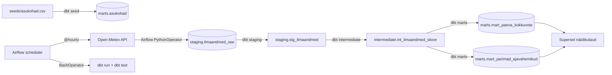

# Arhitektuur

## Äriküsimus

Millistes Eesti asulates ja millistel järgmistel päevadel on ilm kõige sobivam välitegevuste, rattaga liikumise või õues toimuva ürituse planeerimiseks?

## Mõõdikud

1. **Välitegevuse sobivuse skoor** (0–100) iga tunni kohta — temperatuur, sademed, tuul ja päevavalgus kaalutud summa.
2. **Parimad 3-tunnised ajaaknad** asukoha ja päeva lõikes — kesk_skoor ≥ 50.
3. **Päevane soovitus** linnade võrdluseks (Väga sobiv / Sobiv / Piiripealne / Ebasoodne).

## Andmeallikad

| Allikas | Tüüp | Ajas muutuv? | Roll |
|---------|------|--------------|------|
| Open-Meteo Forecast API | Avalik HTTP API, ilma võtmeta | Jah, prognoos uueneb iga tunni järel | Põhiandmevoog — tunnipõhised ilmaandmed (temperatuur, sademed, tuul, päevavalgus) |
| `seeds/asukohad.csv` | Staatiline dbt seed | Ei, muutub ainult projekti muutmisel | Asukohtade koordinaadid API päringuteks |

## Andmevoog

## Andmebaasi kihid

| Kiht | Materiaalsus | Roll |
|------|-------------|------|
| `staging` | Tabel (raw) + Vaade (dbt) | API toorandmed ja puhastatud vaade neile |
| `intermediate` | Vaade | Skooriarvutus — ei salvestata, arvutatakse iga päringu korral |
| `marts` | Tabel | Äriloogika kokkuvõtted, mida Superset loeb |

Iga Airflow käivitus saab uue `run_id`. Vanad andmed jäävad `staging` kihti. `mart` tabelid sisaldavad kõigi käivituste andmeid (Superset filtreerib viimase).

## Tööjaotus

| Roll | Vastutus |
|------|----------|
| Andmeallika omanik | Hoiab Airflow DAG'i töökorras, kontrollib API vastust |
| Transformatsioonide omanik | Kirjutab ja hooldab dbt mudeleid |
| Kvaliteedi omanik | Hoiab schema.yml testid ajakohastena |
| Näidikulaua omanik | Haldab Superset chart'e ja dashboard'i |

## Riskid

| Risk | Mõju | Maandus |
|------|------|---------|
| Open-Meteo API ei vasta | Airflow task ebaõnnestub | Airflow logib vea; käivitamine kordub järgmisel tunnil automaatselt |
| API väljavälja nimed muutuvad | Airflow Python task jookseb kokku | Vigased read jäävad `staging.pipeline_runs` kirjega `status='failed'` |
| dbt test ebaõnnestub | Näidikulaud võib näidata vigaseid andmeid | dbt_test task märgib Airflow töövoo ebaõnnestunuks; Superset näitab endiselt viimaseid edukaid andmeid |
| Superset init aeglane | Esimesel käivitusel tuleb oodata ~2–3 minutit | Docker Compose ei seadista tervist superset'ile vaikimisi — kontrolli logisid |

## Privaatsus ja turve

Projekt kasutab ainult avalikke ilmaandmeid (Open-Meteo). Isikuandmeid ei koguta.
Andmebaasi kasutajanimi ja parool tulevad `.env` failist. `.env` faili ei tohi reposse lisada.
