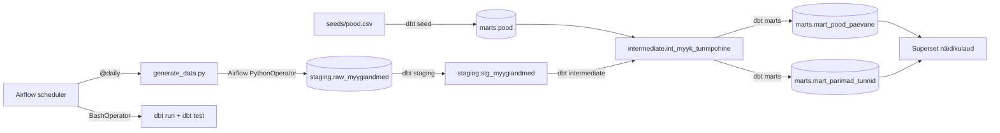

# Arhitektuur

## Äriküsimus

Millistes EstiMüük OÜ kauplustes ja mis kellaaegadel on müügitõhusus (käive külastaja kohta) kõrgeim?

## Mõõdikud

1. **Müügitõhusus** (€/külaline) kaupluse ja kellaaja lõikes — peamine KPI.
2. **Päevane käive ja külastatavus** kaupluse kohta — mahupõhine ülevaade.
3. **Kellaaegade mustrid** (hommik / lõuna / pärastlõuna / õhtu) — millal on tõhusus kõrgeim.

## Miks sünteetilised andmed?

> Pärisandmed sisaldavad klientide isikuteavet (ostuajalugu, makseinfo) ja
> konfidentsiaalset äriteavet (tootepõhine marginaal, tarnijate hinnad), mida
> ei saa avaliku repoga jagada.
>
> Selleks genereerisime statistiliselt samaväärse **sünteetilise andmestiku**, mis
> jäljendab pärisandmete struktuuri ja sesoonset mustrit, kuid ei sisalda ühtegi
> päris tehingut ega klienti. Generaatorkood on `scripts/generate_data.py` — kõik
> mustrid on läbipaistvalt nähtavad.

## Andmeallikad

| Allikas | Tüüp | Ajas muutuv? | Roll |
|---------|------|--------------|------|
| `scripts/generate_data.py` | Python-generaator (numpy) | Ei, genereeritakse ühekorra fikseeritud seemnega | Sünteetilised tunnipõhised müügimõõtmised |
| `seeds/pood.csv` | Staatiline dbt seed | Ei, muutub ainult projekti muutmisel | Kaupluste meta-andmed (nimi, linn, suurus) |

## Andmevoog

## Andmebaasi kihid

| Kiht | Materiaalsus | Roll |
|------|-------------|------|
| `staging` | Tabel (raw) + Vaade (dbt) | Sünteetilised toorandmed ja puhastatud vaade |
| `intermediate` | Vaade | Tõhususe arvutus — ei salvestata, arvutatakse päringul |
| `marts` | Tabel | Agregeeritud andmed Superset'i jaoks |

## Tööjaotus

| Roll | Vastutus |
|------|----------|
| Andmete genereerimise omanik | Hooldab `generate_data.py`, vajadusel kohandab mustreid |
| Transformatsioonide omanik | Kirjutab ja hooldab dbt mudeleid |
| Kvaliteedi omanik | Hoiab schema.yml testid ajakohastena |
| Näidikulaua omanik | Haldab Superset chart'e ja dashboard'i |

## Riskid

| Risk | Mõju | Maandus |
|------|------|---------|
| Sünteetilised mustrid ei vasta ärireaalsusele | Analüüsi järeldused pole üldistuvad | Generaatori parameetreid saab kohandada (baas-külastajad, kellajakordajad) |
| dbt test ebaõnnestub andmetüübi muutmisel | Pipeline jookseb kokku | dbt test käivitub iga DAG-käivitusega; viga on kohe nähtav Airflow UI-s |
| Superset'i ühendus analytics-db'ga puudub | Chart'id ei kuvata | Kontrolli Settings > Database Connections ja vaata logisid |

## Privaatsus ja turve

Projekt kasutab ainult sünteetilisi andmeid. Päris kliendiandmeid, tehinguid ega isikuteavet ei ole. Andmebaasi paroolid tulevad `.env` failist. `.env` faili ei tohi reposse lisada.
